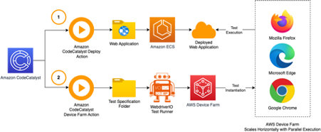

# Introduction
These samples help users get started with AWS Device Farm usage via Amazon CodeCatalyst using a GitHub Action



This is the repo will accompany a future AWS blog post

# Table of Contents
- [Introduction](#introduction)
- [Table of Contents](#table-of-contents)
- [Samples](#samples)
  - [WDIO Runner Sample](#wdio-runner-sample)
    - [Running locally without Amazon CodeCatalyst or the Github action](#running-locally-without-amazon-codecatalyst-or-the-github-action)
  - [Pytest Python Sample](#pytest-python-sample)
    - [Running locally without Amazon CodeCatalyst](#running-locally-without-amazon-codecatalyst)
  - [How to deploy either sample](#how-to-deploy-either-sample)
    - [Deploy Steps](#deploy-steps)
      - [Creating a Project](#creating-a-project)
      - [Changing the Code to include testing](#changing-the-code-to-include-testing)
      - [Reviewing the results](#reviewing-the-results)

# Samples

## WDIO Runner Sample
This example uses WDIO as a runner to configure and run the tests from CodeCatalyst - everything you need including a sample test for the Todo-app is under the wdio-sample directory.

In this example we use the Github action https://github.com/aws-actions/aws-devicefarm-browser-testing

As WDIO takes care of the the creation of Device Farm grid urls then you don't need to worry about this.

The harness folder contains
- A `wdio.conf.js` file which defines the test configuration, number of runners and test report definition. 
- The test specs for the Todo-app are located under the tests folder.

### Running locally without Amazon CodeCatalyst or the Github action
> **_NOTE:_**  You will need AWS credentials AWS CLI and Node installed for this work

It is possible to run the tests from your own machine following this

Make sure you have the appropriate AWS access and credentials
Replace <APP_URL> with the deployed application's web address

```
export PROJECT_ARN=$(aws devicefarm create-test-grid-project --name 'MyTestProject' --region us-west-2 --query testGridProject.arn | tr -d '"') 
export TEST_URL=<APP_URL>

cd harness
npm install
npm run test 2>&1 || true
```

## Pytest Python Sample
This example uses Pytest as a runner, pytest-bdd for behavioral driven testing and pytest-xdist to run the test in parallel 

The harness folder contains 
- A pyproject.toml for dependencies
- A tests folder containing:
  - A features folder with a feature file written in Gherkin style
  - A steps_def folder where the test logic is defined

### Running locally without Amazon CodeCatalyst
> **_NOTE:_**  You will need AWS credentials AWS CLI and Node installed for this work

It is possible to run the tests from your own machine following this

Make sure you have the appropriate AWS access and credentials
Replace <APP_URL> with the deployed application's web address
```
export PROJECT_ARN=$(aws devicefarm create-test-grid-project --name 'MyTestProject' --region us-west-2 --query testGridProject.arn | tr -d '"') 
export GRID_URL=$(aws devicefarm create-test-grid-url --project-arn "$PROJECT_ARN" --expires-in-seconds 900 --region us-west-2 --query url | tr -d '"')

export TODO_APP_URL=<APP_URL>

cd harness
pytest tests/step_defs/ -n logical --junit-xml=results-out.xml
```

## How to deploy either sample
> **_NOTE:_**  Both samples function similarly with changes only in the RunTests action. Pytest needs an AWS Device Farm Grid URL where as WDIO takes care of this for you. 

### Deploy Steps
#### Creating a Project
What we are going to do here is setup a web application which is a To Do app in Amazon CodeCatalyst 

1. Login to Amazon CodeCatalyst.
2. In your chosen space, create a new project (if you don't have a space see [here](https://docs.aws.amazon.com/codecatalyst/latest/userguide/spaces-create.html)).
3. Make sure 'Start with a blueprint' is selected and find the 'To Do web application' - we will use this as our web app to test against.
   > **_NOTE:_**  This sample has been designed to work with the To Do app sample to get you started with testing as quickly as possible - this is where in the future you may decide to use your own web application - but at this point you will need to write your own test specs. The harnesses and actions are reusable.
4. Select this and press next to start the deployment wizard.
5. Enter a Project name.
6. Select your environment, CDK role - Otherwise set these up accordingly for your deployment target. More information on this can be found [here](https://docs.aws.amazon.com/codecatalyst/latest/userguide/deploy-environments-add-app-to-environment.html).
   1. Make sure the role has Device Farm permissions documented here https://github.com/aws-actions/aws-devicefarm-browser-testing#permissions
7. Under Code Repository Name accept the default name or choose a new name.
8. Under Frontend CDK Programming Language - leave as TypeScript or choose another language
   1. Make sure Frontend CloudFormation Stack Name is unique
   2. Select a front end region for the webapp
9.  Under Backend CDK Programming Language - leave as TypeScript or choose another language.
   1.  Make sure Backend CloudFormation Stack Name is unique
10. Finish the wizard and wait for the deployment to complete
    
#### Changing the Code to include testing
What we are going to do here is change the project to include the automatic testing.

1. Navigate to the project and select Code > Source Repositories
   1.  Choose your new code repository
2. Click clone repository and follow the instructions to clone the "todo-app" repository to your development environment
3. Once cloned copy the "wdio-sample/harness" folder from this repo to your clone repo
4. In the "todo-app repo" Open .codecatalyst/workflows/main_fullstack_workflow.yaml
5. Copy the contents of wdio-sample/workflow.yaml from this repo to the bottom of the file
6. Commit and push the todo-app code to CodeCatalyst
7. In Amazon CodeCatalyst open the CI/CD > Workflows UI in your project
8. You will see 3 new action boxes at the end of the visual workflow screen
    1.  One that creates a devicefarm project
    2.  One that runs the tests
    3.  One that gets the DeviceFarm test artifacts
9. Click edit and for each of the 3 new boxes click the configuration tab and add
    1.  The environment
    2.  The Deployment account
    3.  The role
10. Click validate and commit
11. Push your code
12. You can check the pipeline running status on the Workflows tab

#### Reviewing the results
What we are going to do here is review the results from the workflow

1. Click Workflows
   1. You should see a run that is "Green"
   2. If you don't then investigate the logs and what action it failed on
2. Click Runs and click on the latest run id
3. Under Artifacts you will find videos of the runs downloaded from AWS Device Farm.
4. Under Reports you will find the test results generated from the run.
